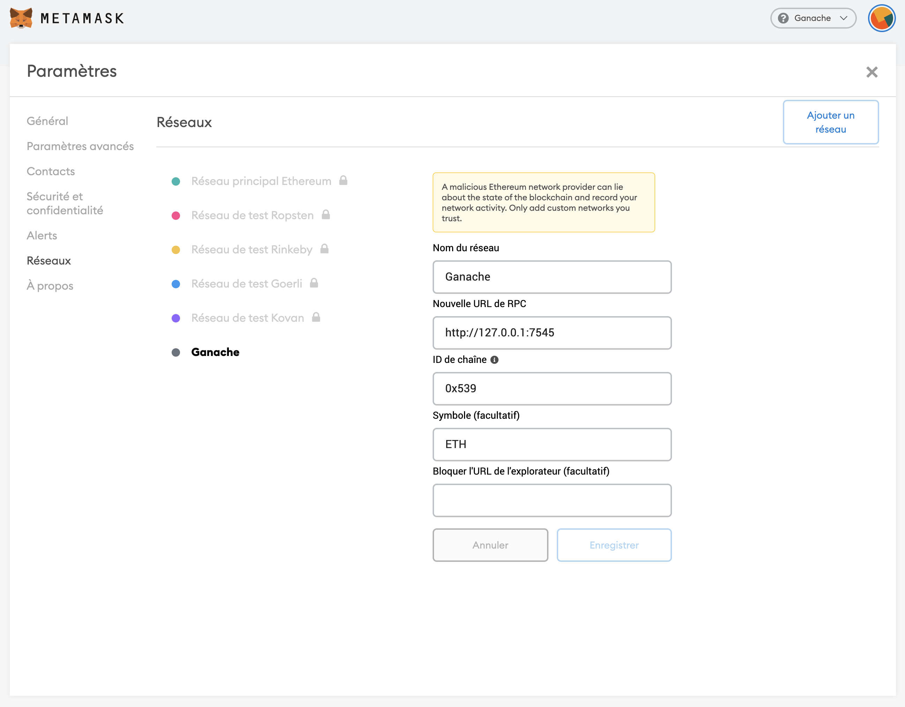

# Decentralized Wikipedia

Welcome to the DAAR project. The idea will be to implement a complete Wikipedia
in a decentralized way, on Ethereum. This will have cool side effects, like not
be forced to pay for servers.

# Installation

You’ll need to install dependencies. You’ll need [`Ganache`](https://www.trufflesuite.com/ganache), [`Node.js`](https://nodejs.org/en/) and [`NPM`](https://www.npmjs.com/). You’ll need to install [`Metamask`](https://metamask.io/) as well to communicate with your blockchain.

- `Ganache` is a local blockchain development, to iterate quickly and avoiding wasting Ether during development.
- `Node.js` is used to build the frontend and running `truffle`, which is a utility to deploy contracts.
- `NPM`  is a package manager, to install dependencies for your frontend development. Yarn is recommended.
- `Metamask` is a in-browser utility to interact with decentralized applications.

# Some setup

Once everything is installed, launch `Ganache`. Create a new workspace, give it a name, and accept. You should have a local blockchain running in local. Now you can copy the mnemonic phrase Ganache generated, open Metamask, and when it asks to import a mnemonic, paste the mnemonic. Create the password of your choice and that’s fine.
Now you can connect Metamask to the blockchain. To do this, add a network by clicking on `main network` and `personalized RPC`. Here, you should be able to add a network.



Once you have done it, you’re connected to the Ganache blockchain!

# Run the frontend

Install the dependencies.

```bash
npm install
```

Compile the contracts.

```bash
# NPM users
npm run contracts:build
```

Create a symlink for your OS.

```bash
# Unix and macOS
ln -s build src/build
```

Migrate the contract on local block chain

```bash
# after open your ganache and setup a local blockchain, migrate your smart contract on blockchain
npm run contracts:migrate
```

Run the frontend
```bash
# NPM users
npm start
```

You' re good to go!

# Subject

Implement a Wikipedia from scratch in Solidity.

The program should be able to:

- Read an article by its ID (an uint).
- Someone should be able to submit a new article with ID and content.
- Someone should be able to update an article.

Bonus:

- Keep history of modifications and display it in the app.
- Integrate the DApp with [Fortmatic](https://fortmatic.com/).
